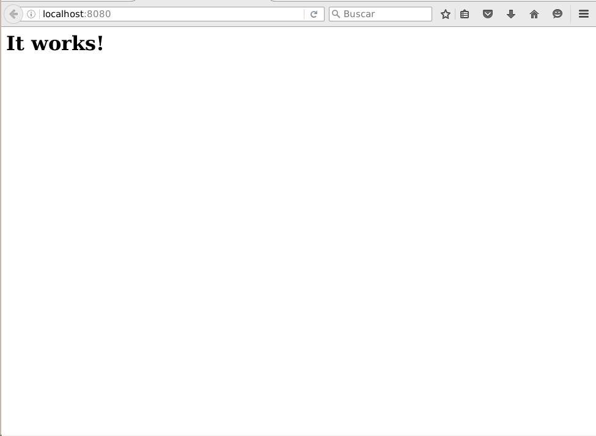
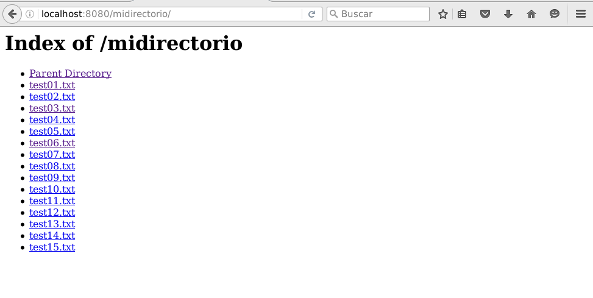
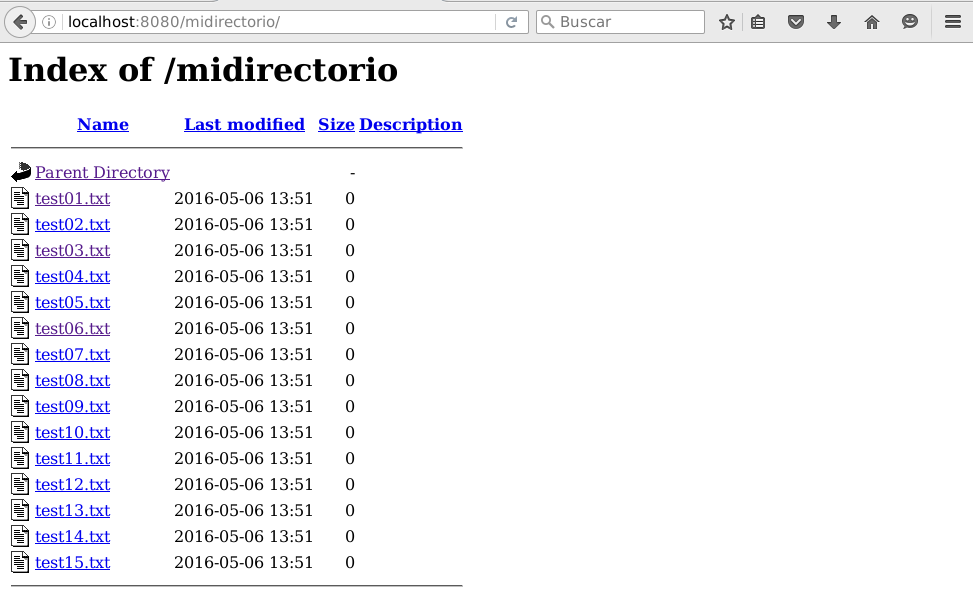

Memoria Práctica 4: Apache
==========================

1. Introducción (ej 1-3)
----------------------
Tras ejecutar el script de instalación, hay que añadir al $PATH el directorio
con los ejecutables de Apache, o ir a la carpeta y ejecutar directamente el
archivo.

Sin cambiar el puerto donde escucha el servidor, no se inicia al intentar
escuchar en el puerto 80, ya que está restringido el acceso. Para poder
iniciar el servidor hay que cambiar el puerto en el que el servidor escucha.
Para ello en el fichero https.conf dentro de la carpeta httpd/conf, buscamos
la línea *52*, y cambiamos la opción *Listen* de 80 a 8080 (o cualquier otro
puerto que queramos mientras esté libre).

Tras hacer esto ejecutamos el archivo apachectl dentro de la carpeta httpd/bin,
pasándole el argumento *start*: *./apachectl start*. A continuación, accedemos
en el navegador a la dirección **localhost:8080**. Debe salir el mensaje:
*"It works!"*.

2. Directorio de archivos (ej 4-6)
----------------------------------
Para cambiar el directorio donde están los archivos que se sirven, hay que
cambiar en las opciones estas dos líneas, situadas en las líneas *214-215*:
> DocumentRoot "/home/i42sadef/httpd/htdocs"
> <Directory "/home/i42sadef/httpd/htdocs">
Cambiamos la carpeta en ambas líneas por el directorio deseado, en este caso:
*/home/i42sadef/httpd-docs*.

El archivo base que se sirve por defecto es *index.html*, y si no lo encuentra
devuelve un error de *404 Not Found*, para cambiar el nombre del archivo por
defecto se puede editar en el archivo de configuración la línea *248*:
`DirectoryIndex index.html`. Es posible poner varios archivos separados por
espacios, de forma que si no encuentra el primero, use el segundo y así
sucesivamente. Para probarlo podemos tener dos ficheros en el directorio
**httpd-docs**, uno *index.html* y otro *index.htm*. Si hemos configurado apache
de la siguiente forma: `DirectoryIndex index.html index.htm`. Entonces si
eliminamos *index.html* automáticamente servirá *index.htm*. Y en el momento
que volvamos a crear *index.html* comenzará a servir ese archivo.

Por defecto el directorio raiz incluye la **Indexes** en la linea *228*
`Options Indexes FollowSymLinks`. Esta opción es la que permite a Apache crear
automáticamente un listado de un directorio cuando no tiene un archivo de
índice *(ej. index.html)*. Para probar esta opción crearemos un directorio de
prueba dentro del directorio raiz. Y dentro creamos unos cuantos ficheros
de prueba con el comando `touch test{01..15}.txt`. A continuación accedemos
a la ruta **localhost:8080/midirectorio**. Y debe aparecer un listado de todos
los ficheros.

Si queremos evitar que se puedan listar los directorios basta con eliminar la
opción *Indexes* mencionada antes. Aunque si lo que queremos es que algún
directorio en concreto no se pueda mostrar se puede hacer añadiendo lo siguiente
al archivo de configuración. Lo cual desactiva la opción solo para
este directorio. Devolviendo un error de accesso prohibido *(Forbidden)* cuando
se intenta acceder a este directorio.

    <DirectoryMatch "/midirectorio">
        Options -Indexes
    </DirectoryMatch>

También se puede mejorar el aspecto visual de los índices descomentando la
línea *455*: `Include conf/extra/httpd-autoindex.conf`.

3. Conexión al servidor (ej7-)
------------------------------
